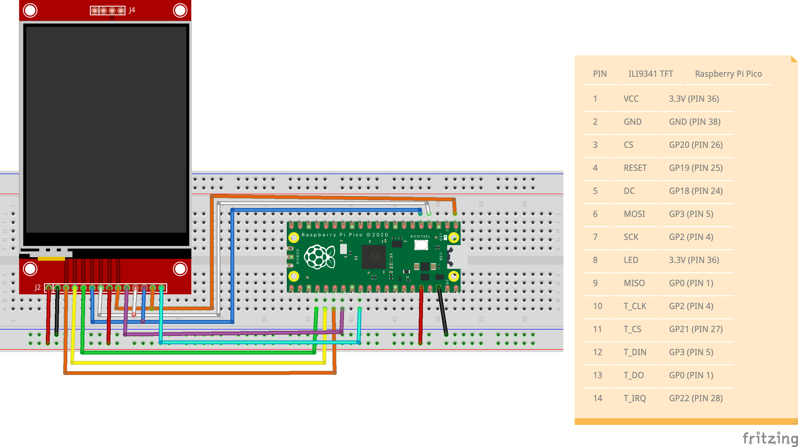

# pico-hello-world-lcd
Basic example on using Embedded Rust to drive an ILI9341 display via SPI on Raspberry Pi Pico.

Project generated from [rp-rs/rp2040-project-template](https://github.com/rp-rs/rp2040-project-template)

Using [mipidsi](https://docs.rs/mipidsi/latest/mipidsi/) crate that provides a generic display driver to connect to TFT displays that implement the [MIPI Display Command Set](https://www.mipi.org/specifications/display-command-set).

